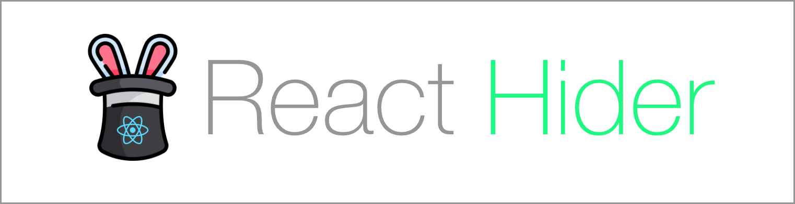

 

<strong>Conditional Rendering Made Easy</strong>

A minimalist show or not library based on conditional rendering foundations

 

<!-- Badges -->

&nbsp;&nbsp;&nbsp;

    Created by <a href="https://twitter.com/theoliveralr">Oliver ALR</a> and mantained with ❤️ and ☕️. Join me just contributing :atom:

## Features

Add features...

## License

This project is licensed under the MIT license, Copyright © 2020 Oliver ALR.
For more information see `LICENSE.md`.
